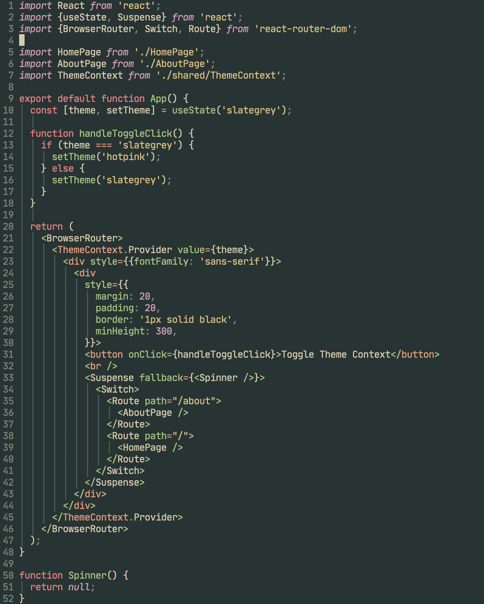

# thicc_forest

My Neovim colorscheme.



## Install

Add thicc_forest as a plugin.

```lua
use {
  "mhanberg/thicc_forest", 
  requires = {"rktjmp/lush.nvim"},
  config = function()
    vim.cmd [[color thicc_forest]]
  end,
}
```

## Supported Plugins

- [lualine.nvim](https://github.com/nvim-lualine/lualine.nvim)
- [fzf.vim](https://github.com/junegunn/fzf.vim)
- [LSP Diagnostics](https://neovim.io/doc/user/lsp.html)
- [nvim-cmp](https://github.com/hrsh7th/nvim-cmp)

### lualine.nvim

```lua
require("lualine").setup({ options = { theme = require("thicc_forest.lualine") } })
```

## Acknowledgements

Thicc Forest was forked from [everforest](https://github.com/sainnhe/everforest) and converted to a [Lush](https://github.com/rktjmp/lush.nvim) theme.
